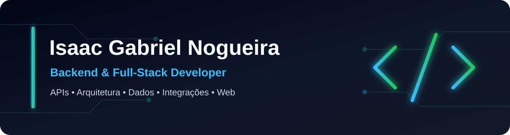

  

  
  
  

## Sobre mim

Sou **Isaac Gabriel Nogueira**, desenvolvedor de software com foco em **backend e full-stack**. Construo aplicações web, APIs e integrações com atenção à organização do código, regras de negócio, modelagem de dados, testes e documentação.

- Desenvolvedor na **Eitree, Inc.** desde julho de 2023, em trabalho remoto.
- Experiência com desenvolvimento web e backend, React, Python e sistemas para organização não governamental.
- Tenho **20 anos** e mantenho aprendizado contínuo por meio da graduação e de projetos reais.
- Graduando em **Engenharia de Software** e interessado em arquitetura de software, automação e infraestrutura.
- Baseado em **Aparecida do Norte, Vale do Paraíba, São Paulo, Brasil**.

## Tecnologias e ferramentas

### Linguagens

### Frontend

### Backend

### Bancos de dados

### Infraestrutura e DevOps

### Ferramentas e qualidade

## Projetos em destaque

| Projeto | Situação | Tecnologias confirmadas | O que demonstra |
| --- | --- | --- | --- |
| **Liberty - plataforma para RPG cyberpunk** | Em evolução · código privado | React, Vite, Node.js, Express, SQLite, MapLibre GL e testes automatizados | Aplicação full-stack com autenticação, personagens, inventário, equipes, mensagens, loja, arena, mapas, administração e sincronização em tempo real. |
| **Coroa Santa Hotel** | Em desenvolvimento · código privado | Next.js 16, React 19, TypeScript, CSS Modules, ESLint e processamento de mídia | Site institucional responsivo, arquitetura por componentes, conteúdo estruturado, SEO, acessibilidade e curadoria de mídia. |
| **Protótipo Coroa Santa** | Legado · código privado | HTML, CSS, JavaScript e jQuery | Primeira versão do site do hotel, útil para acompanhar a evolução de uma implementação estática para uma arquitetura moderna. |

> Os repositórios dos projetos em destaque permanecem privados. As descrições acima refletem somente funcionalidades e tecnologias verificadas no código.

## Experiência profissional

### Desenvolvedor · Eitree, Inc.

**Julho de 2023 - atual · remoto**

- Desenvolvimento web e backend com participação em sistemas para organização não governamental.
- Trabalho com React.js, Python, integração entre camadas e evolução de aplicações.
- Experiência complementar em projetos pessoais, trabalhos freelance e soluções sob demanda.

## Formação acadêmica

- **Bacharelado em Engenharia de Software - UniCesumar**
  - Março de 2026 - previsão de conclusão em julho de 2030.
- **Curso Superior de Tecnologia em Tecnologia da Informação - ETEC Getúlio Vargas**
  - Janeiro de 2024 - julho de 2025.

## Certificados e cursos

- Administrando Banco de Dados - Fundação Bradesco.
- AI-900: Fundamentos de IA no Azure - Fundação Bradesco.
- Linguagem de Programação Python - Fundação Bradesco.
- Imersão Dados com Python - Alura.
- Java: API conectando ao front - Alura.
- Java: Lambdas, Streams e Spring Framework - Alura.

## Principais competências

- Desenvolvimento e organização de APIs.
- Arquitetura backend e separação de responsabilidades.
- Integração entre frontend, backend e serviços.
- Modelagem, persistência e migração de dados.
- Autenticação, autorização e controle de sessão.
- Testes automatizados, lint e diagnóstico de falhas.
- Docker, automação de rotinas e configuração de ambientes.
- Documentação técnica e evolução de projetos complexos.

## Atualmente estudando

- Engenharia de Software na UniCesumar.
- Arquitetura de aplicações e integração de sistemas.
- Qualidade de software, testes e automação de entrega.
- Desenvolvimento backend e full-stack aplicado a projetos reais.

## Objetivos profissionais

Busco oportunidades e projetos em **backend ou full-stack** nos quais eu possa contribuir com APIs, arquitetura de software, bancos de dados, integrações, automação e desenvolvimento web, enquanto continuo aprofundando práticas de qualidade e infraestrutura.

## Contato

- **E-mail:** [IsaacGFX12@gmail.com](mailto:IsaacGFX12@gmail.com)
- **LinkedIn:** [linkedin.com/in/isaac-nogueira-513a7532b](https://www.linkedin.com/in/isaac-nogueira-513a7532b/)
- **GitHub:** [github.com/GFXFN](https://github.com/GFXFN)
